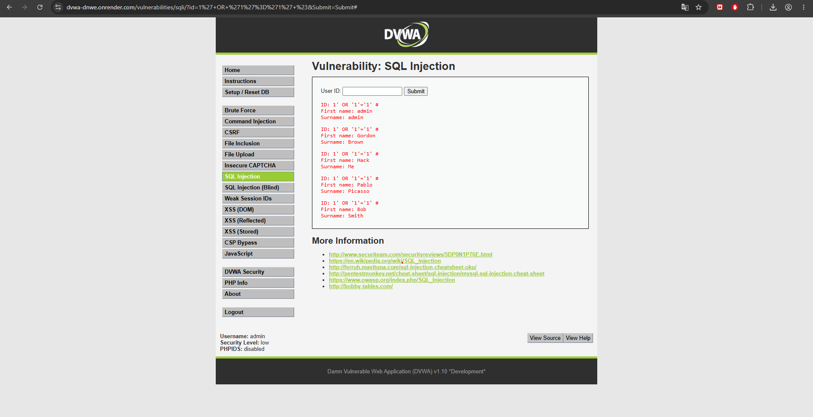
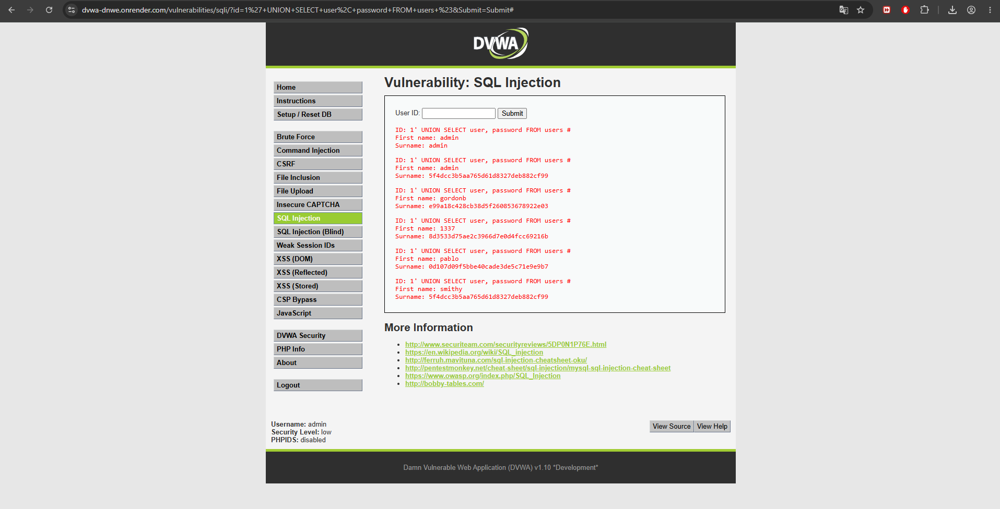
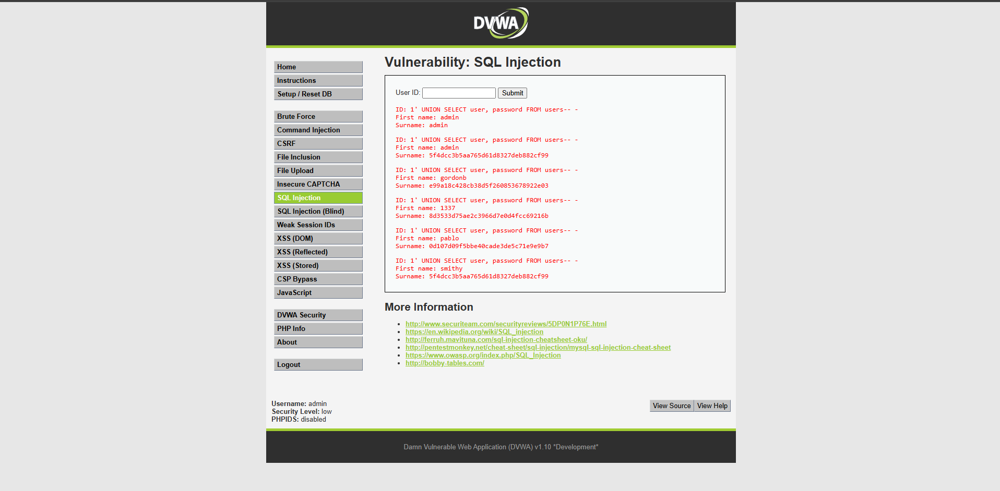
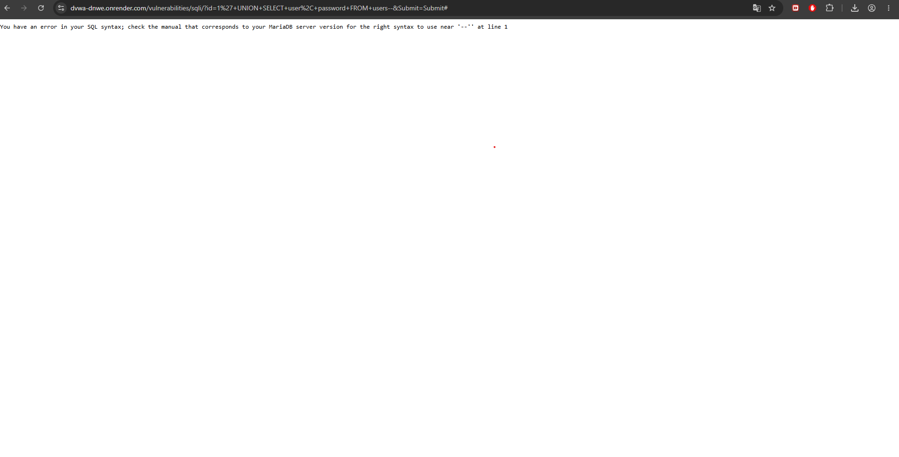

Módulo DVWA: SQL Injection (Security Level: Low)

Descripción del ataque:

La inyección SQL ocurre cuando una aplicación web incorpora directamente la entrada del usuario en una consulta SQL sin validación ni sanitización. El atacante inserta código SQL malicioso que altera la lógica de la consulta original.

Dato ingresado:

1' OR '1'='1' #

Consulta SQL resultante (internamente):

sqlSELECT first_name, last_name FROM users WHERE user_id = '1' OR '1'='1' #';

Como '1'='1' es siempre verdadero, la condición WHERE se anula y retorna todos los registros de la tabla.

Segunda prueba — extracción de credenciales:

1' UNION SELECT user, password FROM users #

Resultado obtenido:

Se extrajeron los nombres de usuario y contraseñas hasheadas (MD5) de todos los usuarios registrados en la base de datos.

¿Por qué funciona?

El código PHP vulnerable concatena directamente la entrada del usuario en la consulta SQL sin usar sentencias preparadas (prepared statements). El carácter ' rompe la cadena SQL original, y el operador OR '1'='1' hace que la condición sea siempre verdadera. El # comenta el resto de la consulta original.

Impacto en Notaría Central Digital:

Un atacante podría extraer datos de clientes, contratos, escrituras públicas, credenciales de acceso y cualquier otro dato almacenado en la base de datos. En el contexto notarial, esto constituye una violación grave de la confidencialidad de información legalmente protegida.

### Clasificación CVSS v3.1

Calculado con la calculadora oficial first.org/cvss/calculator/3.1:

| Métrica | Valor | Justificación |
|---|---|---|
| Attack Vector (AV) | Network (N) | El formulario es explotable de forma remota, vía HTTP. |
| Attack Complexity (AC) | Low (L) | No requiere condiciones especiales; el payload funciona al primer intento. |
| Privileges Required (PR) | None (N) | No se requiere ningún privilegio adicional al de un usuario normal del formulario. |
| User Interaction (UI) | None (N) | El atacante ejecuta el ataque directamente, sin intervención de un tercero. |
| Scope (S) | Unchanged (U) | El ataque no escapa del componente vulnerable hacia otros componentes con distinto control de autorización. |
| Confidentiality (C) | High (H) | Permite extraer la totalidad de la base de datos (usuarios, contraseñas, datos notariales). |
| Integrity (I) | High (H) | Con UNION/INSERT/UPDATE el atacante podría alterar registros (contratos, escrituras). |
| Availability (A) | High (H) | Consultas pesadas o DROP TABLE pueden dejar el servicio fuera de línea. |

**Vector CVSS:** `AV:N/AC:L/PR:N/UI:N/S:U/C:H/I:H/A:H`

**Puntaje Base: 9.8 — Severidad Crítica**