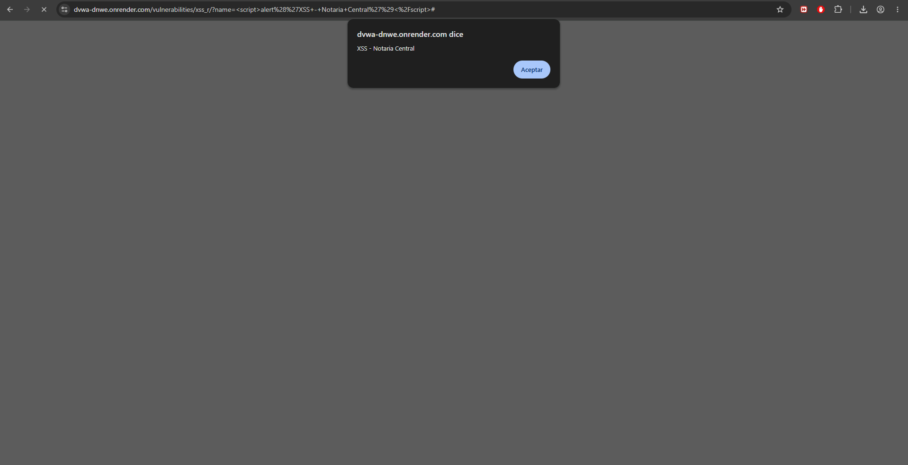

Módulo DVWA: XSS (Reflected) (Security Level: Low)

Descripción del ataque:

El XSS reflejado ocurre cuando una aplicación web recibe datos del usuario y los incluye directamente en la respuesta HTML sin escapar caracteres especiales. El navegador interpreta y ejecuta el código JavaScript inyectado.

Dato ingresado:

html

URL resultante:

/vulnerabilities/xss_r/?name=

Resultado obtenido:

El navegador ejecutó el script y mostró un cuadro de diálogo de alerta con el texto "XSS - Notaria Central", confirmando que el código JavaScript fue interpretado por el navegador de la víctima.

¿Por qué funciona?

La aplicación refleja la entrada del usuario directamente en el HTML de la respuesta sin aplicar funciones de escape como htmlspecialchars() en PHP. El navegador recibe la etiqueta <script> como parte del DOM y la ejecuta.

Impacto en Notaría Central Digital:

Un atacante podría usar XSS para robar cookies de sesión de clientes o funcionarios de la notaría, redirigir a usuarios a sitios de phishing, modificar visualmente el contenido del portal para engañar a usuarios, o realizar acciones en nombre del usuario autenticado (robo de sesión).

### Clasificación CVSS v3.1

Calculado con la calculadora oficial first.org/cvss/calculator/3.1:

| Métrica | Valor | Justificación |
|---|---|---|
| Attack Vector (AV) | Network (N) | El payload se entrega mediante una URL accesible remotamente (parámetro `name`). |
| Attack Complexity (AC) | Low (L) | Basta con que la víctima abra el enlace manipulado. |
| Privileges Required (PR) | None (N) | El atacante no necesita autenticarse para construir el enlace malicioso. |
| User Interaction (UI) | Required (R) | A diferencia de SQLi, el ataque depende de que la víctima haga clic en el enlace con el payload reflejado. |
| Scope (S) | Changed (C) | El script se ejecuta en el contexto del navegador de la víctima, fuera del componente servidor que originó la falla, pudiendo afectar otras sesiones/origenes de confianza (robo de cookies). |
| Confidentiality (C) | Low (L) | Permite robo de cookies de sesión, pero no acceso directo a la base de datos. |
| Integrity (I) | Low (L) | Permite alterar el contenido visual percibido por la víctima (defacement parcial, phishing). |
| Availability (A) | None (N) | No provoca caída del servicio. |

**Vector CVSS:** `AV:N/AC:L/PR:N/UI:R/S:C/C:L/I:L/A:N`

**Puntaje Base: 6.1 — Severidad Media**