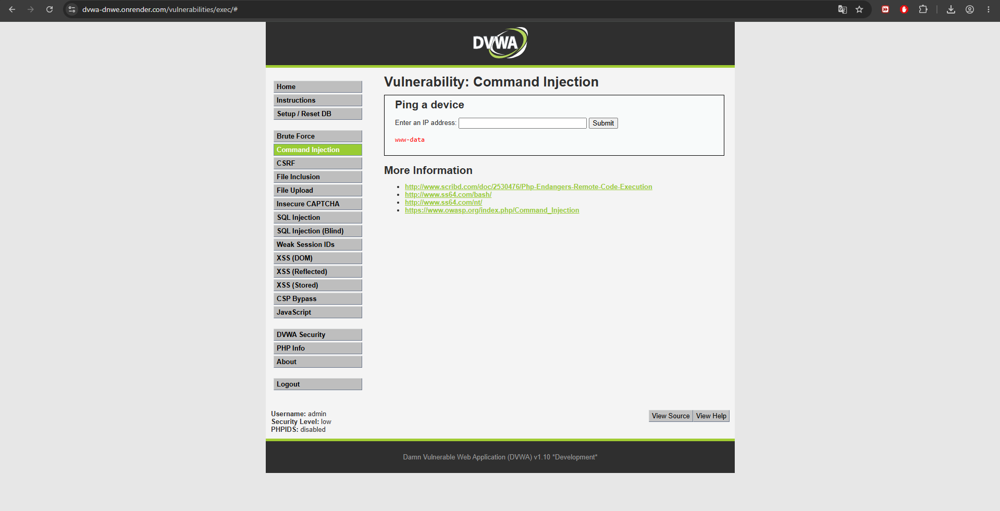

Módulo DVWA: Command Injection (Security Level: Low)

Descripción del ataque:

La inyección de comandos ocurre cuando una aplicación pasa entrada del usuario directamente a una función del sistema operativo (como shell_exec(), system() o exec() en PHP) sin validación. El atacante puede encadenar comandos adicionales usando operadores del shell como |, && o ;.

Dato ingresado:

127.0.0.1 | whoami

Resultado obtenido:

El servidor ejecutó el comando whoami y retornó el nombre del usuario del sistema operativo bajo el cual corre el servidor web (por ejemplo: www-data o apache).

> **Nota sobre la evidencia:** la captura muestra el resultado del comando (`www-data`) tal como lo devolvió el servidor. El campo de entrada del formulario aparece vacío porque DVWA limpia el `<input>` tras enviar la solicitud; el payload ingresado fue `127.0.0.1 | whoami`, visible en la barra de direcciones del navegador en la URL de la petición y en el campo "Dato ingresado" de este documento.

¿Por qué funciona?

El código PHP vulnerable usa shell_exec("ping " . $_GET['ip']) sin validar la entrada. El operador | (pipe) en sistemas Unix encadena el resultado del primer comando como entrada del segundo, o simplemente ejecuta ambos. Así, whoami se ejecuta con los privilegios del proceso del servidor web.

Impacto en Notaría Central Digital:

Un atacante podría ejecutar comandos arbitrarios en el servidor: listar y leer archivos privados (ls, cat), exfiltrar documentos notariales, instalar malware o backdoors, o comprometer completamente el servidor y toda la infraestructura conectada.

### Clasificación CVSS v3.1

Calculado con la calculadora oficial first.org/cvss/calculator/3.1:

| Métrica | Valor | Justificación |
|---|---|---|
| Attack Vector (AV) | Network (N) | El formulario "Ping a device" es accesible remotamente vía HTTP. |
| Attack Complexity (AC) | Low (L) | No requiere condiciones especiales; el operador `\|` funciona en el primer intento. |
| Privileges Required (PR) | None (N) | No se requiere ningún privilegio adicional al de un usuario normal del formulario. |
| User Interaction (UI) | None (N) | El atacante ejecuta el ataque directamente, sin intervención de un tercero. |
| Scope (S) | Unchanged (U) | El comando se ejecuta dentro del mismo proceso/servidor que origina la falla. |
| Confidentiality (C) | High (H) | Permite leer cualquier archivo accesible al usuario del proceso web (documentos, configuración, credenciales). |
| Integrity (I) | High (H) | Permite escribir o modificar archivos, instalar backdoors o alterar la aplicación. |
| Availability (A) | High (H) | Permite detener servicios o saturar el servidor (p. ej. `rm`, fork bombs). |

**Vector CVSS:** `AV:N/AC:L/PR:N/UI:N/S:U/C:H/I:H/A:H`

**Puntaje Base: 9.8 — Severidad Crítica**
---

## Tabla resumen CVSS y priorización

| Vulnerabilidad | Vector CVSS v3.1 | Puntaje | Severidad |
|---|---|---|---|
| SQL Injection | `AV:N/AC:L/PR:N/UI:N/S:U/C:H/I:H/A:H` | 9.8 | Crítica |
| Command Injection | `AV:N/AC:L/PR:N/UI:N/S:U/C:H/I:H/A:H` | 9.8 | Crítica |
| XSS Reflejado | `AV:N/AC:L/PR:N/UI:R/S:C/C:L/I:L/A:N` | 6.1 | Media |

**Orden de atención recomendado:** (1) SQL Injection, (2) Command Injection, (3) XSS Reflejado.

SQLi y Command Injection comparten el puntaje máximo de severidad (9.8) porque ambas permiten compromiso total de confidencialidad, integridad y disponibilidad sin requerir interacción de la víctima ni privilegios previos. Se prioriza SQL Injection en primer lugar porque expone directamente la base de datos completa de la notaría (clientes, contratos, credenciales), el activo de mayor valor del negocio, y porque es además la puerta de entrada más común para escalar hacia Command Injection si ambos formularios comparten el mismo servidor. XSS se atiende en tercer lugar: su severidad es media porque requiere interacción del usuario (clic en un enlace) y su alcance de daño (robo de sesión, phishing) es menor que el compromiso directo del servidor o la base de datos.

## Políticas de prevención y controles de mitigación (resumen)

| Vulnerabilidad | Prevención (causa raíz) | Mitigación (marco de referencia) |
|---|---|---|
| SQL Injection | Consultas parametrizadas (PDO/MySQLi), ORM, validación de tipos, mínimo privilegio en BD | WAF con reglas OWASP CRS, monitoreo de consultas anómalas, cifrado AES-256 — **OWASP A03:2021 · CIS Control 13** |
| XSS Reflejado | Escape de salida (`htmlspecialchars`), Content Security Policy, frameworks que escapan output por defecto | Headers CSP estrictos, escaneo periódico (OWASP ZAP/Burp Suite), cookies `HttpOnly`+`Secure` — **OWASP A03:2021 · CIS Control 16** |
| Command Injection | Validar IP con `filter_var(FILTER_VALIDATE_IP)`, `escapeshellarg()`, evitar `shell_exec`, listas blancas | Contenedores con privilegios mínimos (Docker), IDS/IPS, auditoría de logs del SO — **OWASP A03:2021 · CIS Control 4** |

El detalle ampliado de cada control se desarrolla en el Informe B (Matriz de Riesgo), sección de Controles de Mitigación y Recuperación ante Desastres.
